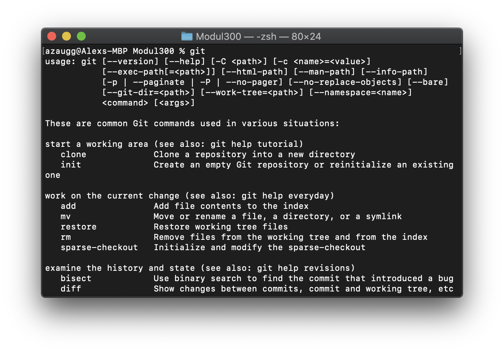

19.08.2020

#Allgemeine Ziele

Github Account wurde erstellt
Git-Client wurde heruntergeladen und installiert.

[]

Dokumentation ist als Mark down vorhanden und wird mit Visual Studio Code bearbeiten

#Persönlicher Wissenstand:

Adam:

Alex:

Heute habe ich gelernt, wie man ein Github Repository mit meinem PC synchronisieren kann.

Wichtige Befehl für den Git-Client:
git add -A änderungen werden erkennt
git commit -m "Kommentar" Die Änderungen werden auf dem Gerät gespeichert (lokal)
git push Die Änderungen werden auf GitHub geladen.

Desweiteren habe ich Vagrant kennen gerlernt. Damit kann man Konfigurationsdateien erstellen für VM, damit man nicht immer die VM manuell aufsetzten muss.

 
Even: